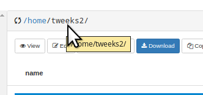
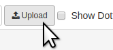
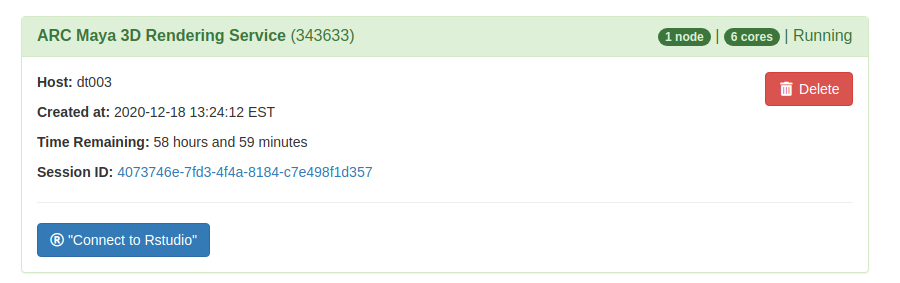
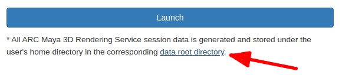
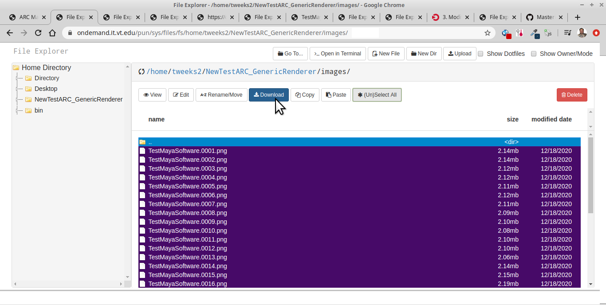

# Batch Connect - Maya 3d Rendering Container

## ARC Maya 3D Rendering Service

This app will launch a multi-threaded, Maya 3D rendering job on ARC. The user need only:

1) First, upload your Maya project to yor ARC home drive by clicking on the download link and navigating to your /home/username/ home directory (upload the whole Maya Project directory:

 

and select your local (PC/laptop) Maya Project folder to upload.

2) Use the "ARC Maya 3D Rendering Service" tool to set your Maya project directory location (e.g. My_Project_Folder)

3) Then set the scene file to render. (e.g. scenes/My_Scene.mb)

4) LAUNCH the render job. Here's what a running job looks like. 

5) Once running job completes (disappears), navigate to your homedir link as seen here:

and navigate to your project directory, into your images folder, and highlight images (or click Select-All to highlight all files) and click download.

    NOTE: If rendering multiple times, it is recommended
    to delete all files between renders (to minimize output confusion).
